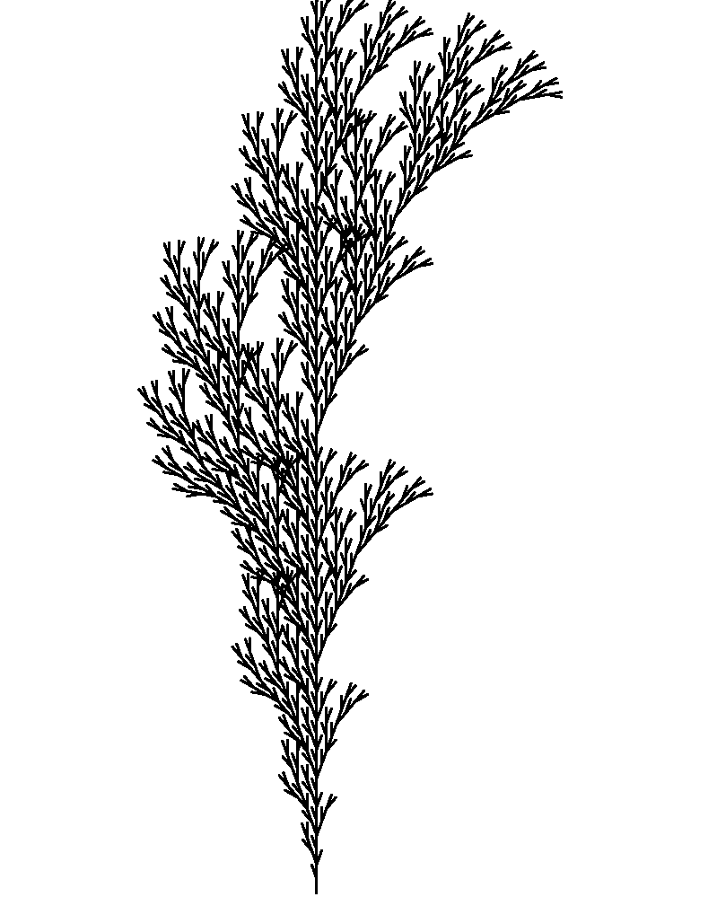
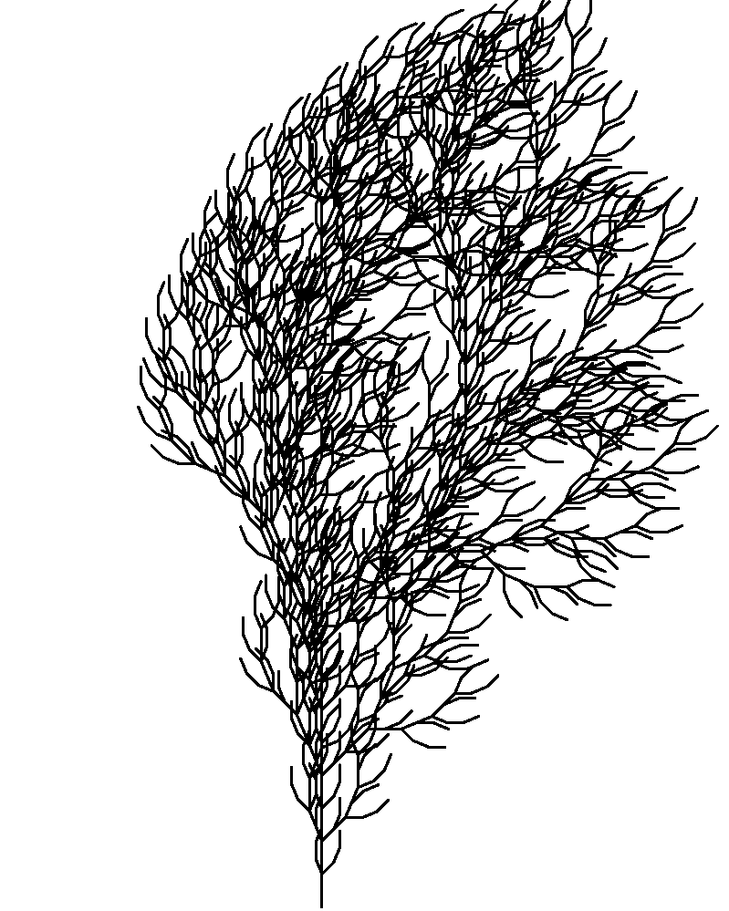
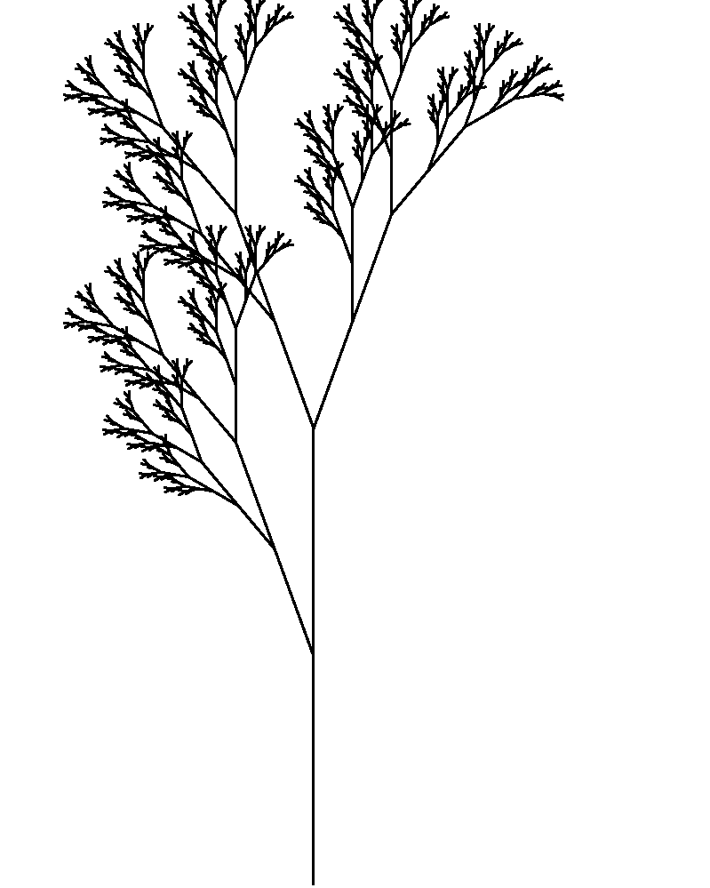
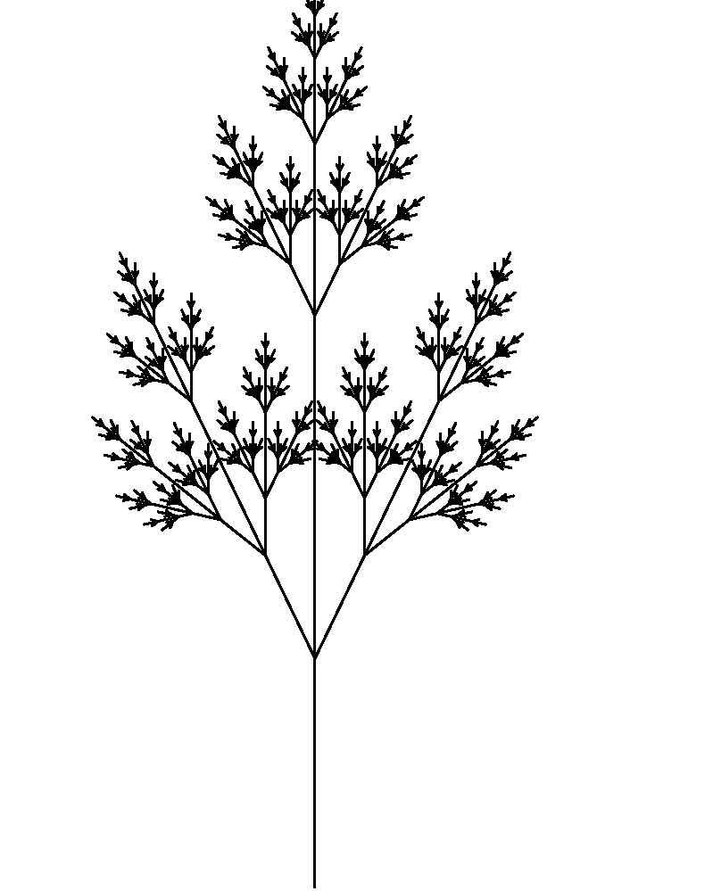
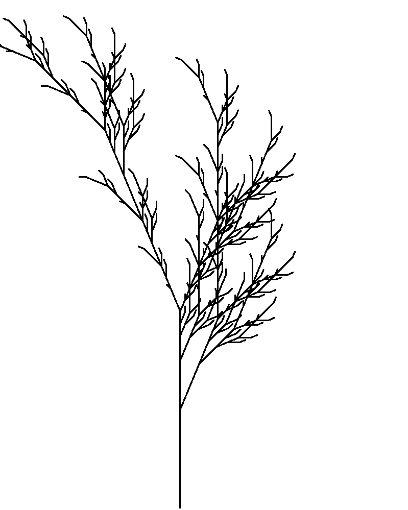

# L-system

This repo explores implementing trees and city maps/layouts using the L-system and PyGame. 

The following city maps/layouts are generated using ...

## Improved 2D City Layout
## 2D City Layout

The following plants images are generated using production rules from [[1]](http://algorithmicbotany.org/papers/abop/abop.pdf). For simplicity, we only care about deterministic context free L-systems (DOL-Systems).

## Improved 3D Trees
## Improved 2D Trees
## 3D Trees
## 2D Trees
Modify parameters in `tree-2d.py` based on Figure 1.24 in Sec 1.6.3 Bracketed OL-systems (p.25), then run `python tree-2d.py`
<table>
    <tr style="backgroun-color:white">
        <td>
            
            
(a)

        </td>
        <td>
            
            
(b)

        </td>
        <td>
            
            
(c)

        </td>
    </tr>
    <tr style="backgroun-color:white">
        <td>
            
            
(d)

        </td>
        <td>
            
            
(e)

        </td>
        <td>
            
            
(f)

        </td>
    </tr>
</table>

# Reference:
[1] [The Algorithmic Beauty of Plants](http://algorithmicbotany.org/papers/abop/abop.pdf) - Przemyslaw Prusinkiewicz and Aristid Lindenmayer

[2] [Fractal Trees - L-System](https://youtu.be/E1B4UoSQMFw) - The Coding Train