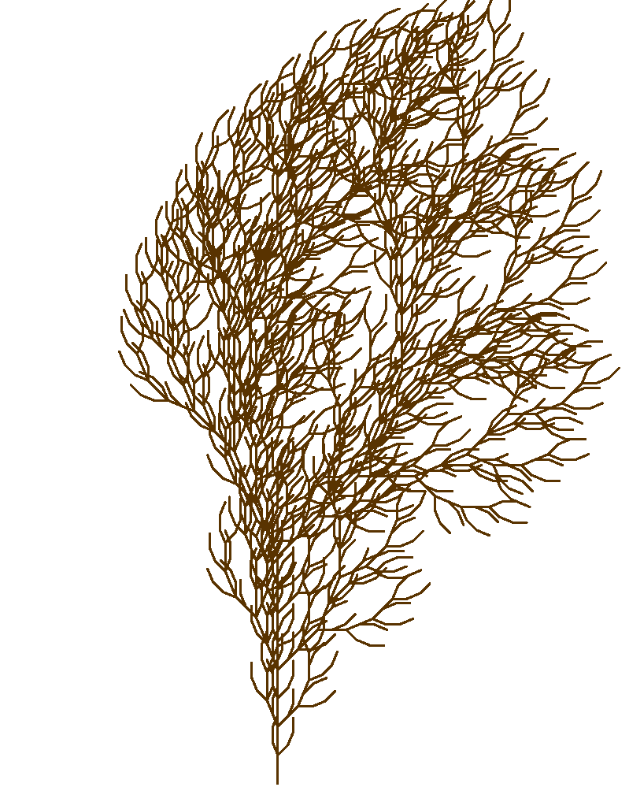

# L-system

This repo explores implementing trees and city maps/layouts using the L-system and PyGame.

    <h3>Simple 2D Tree</h3>
    

# Reference:
* [The Algorithmic Beauty of Plants](http://algorithmicbotany.org/papers/abop/abop.pdf) - Przemyslaw Prusinkiewicz and Aristid Lindenmayer

Some other resources I found useful, especially at the beginning:
* [Fractal Trees - L-System](https://youtu.be/E1B4UoSQMFw) - The Coding Train