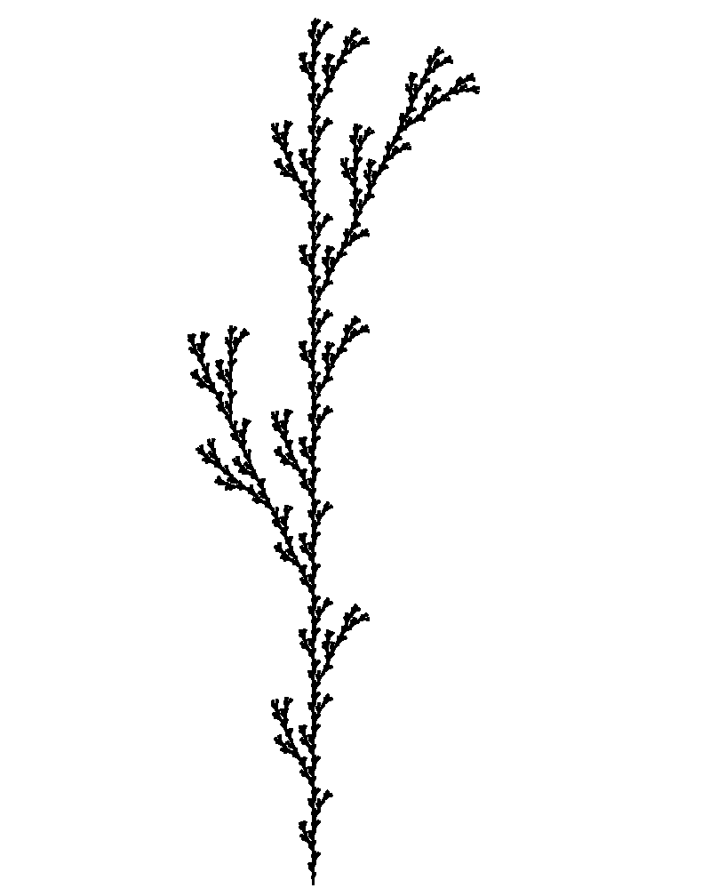

# L-system

This repo explores implementing trees and city maps/layouts using the L-system and PyGame. 

The following city maps/layouts are generated using ...

## 2D City Layout

The following plants images are generated using production rules from [[1]](http://algorithmicbotany.org/papers/abop/abop.pdf). For simplicity, we only care about deterministic context free L-systems (DOL-Systems).

## 3D Trees
Production rule includes rotations in 3D. Positions become 3D instead of 2D.

<b>IMPORTANT:</b> All the 3D rotations here refer to rotations relative to the current Heading (H), Left (L), and Up (U) directions, but not fixed coordinates like in the traditional yaw, roll, and pitch rotations.

For simplicity, we only do a orthogonal projection of the 3D tree onto the xy plane.

## 2D Trees
Given an axiom, a production rule, and the number of iterations, we draw all the branches of the tree starting from an initial point. Each branch comes from an array of operations to draw on the screen using Turtle. Parameters referred to Figure 1.24 in Sec 1.6.3 Bracketed OL-systems (p.25).
<table>
    <tr>
        <td>
            
            
(a)

        </td>
        <td>
            
            
(b)

        </td>
        <td>
            
            
(c)

        </td>
    </tr>
    <tr>
        <td>
            
            
(d)

        </td>
        <td>
            
            
(e)

        </td>
        <td>
            
            
(f)

        </td>
    </tr>
</table>

# Reference:
[1] [The Algorithmic Beauty of Plants](http://algorithmicbotany.org/papers/abop/abop.pdf) - Przemyslaw Prusinkiewicz and Aristid Lindenmayer

[2] [Fractal Trees - L-System](https://youtu.be/E1B4UoSQMFw) - The Coding Train