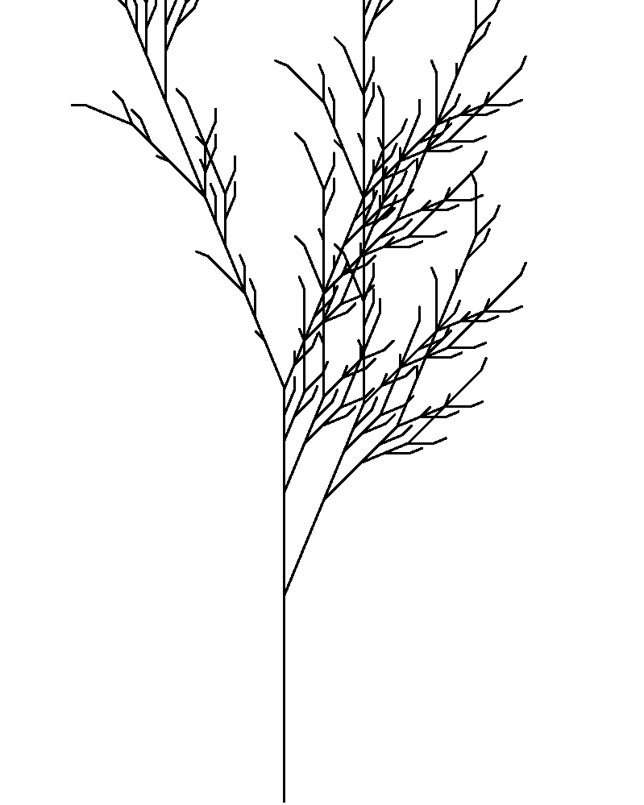

# L-system

This repo explores implementing trees and city maps/layouts using the L-system and PyGame.

<table>
    <tr>
        <td>
            
            <caption>(a)</caption>
        </td>
        <td>
            
            <caption>(b)</caption>
        </td>
        <td>
            
            <caption>(c)</caption>
        </td>
    </tr>
    <tr>
        <td>
            
            <caption>(d)</caption>
        </td>
        <td>
            
            <caption>(e)</caption>
        </td>
        <td>
            
            <caption>(f)</caption>
        </td>
    </tr>
</table>

# Reference:
* [The Algorithmic Beauty of Plants](http://algorithmicbotany.org/papers/abop/abop.pdf) - Przemyslaw Prusinkiewicz and Aristid Lindenmayer

Some other resources I found useful, especially at the beginning:
* [Fractal Trees - L-System](https://youtu.be/E1B4UoSQMFw) - The Coding Train